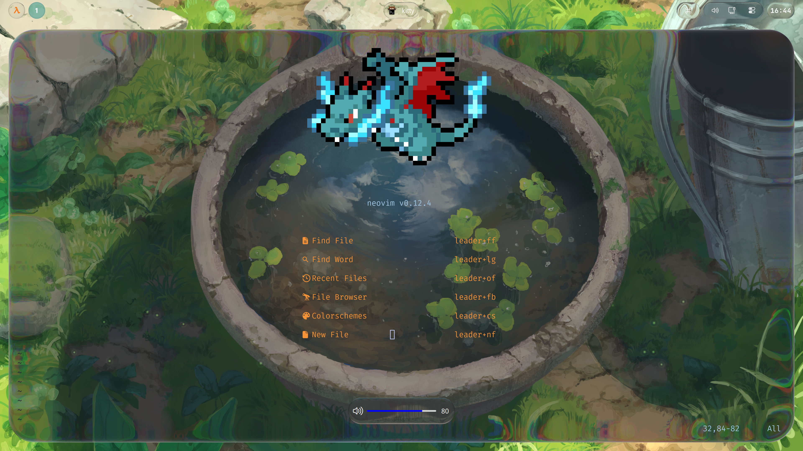
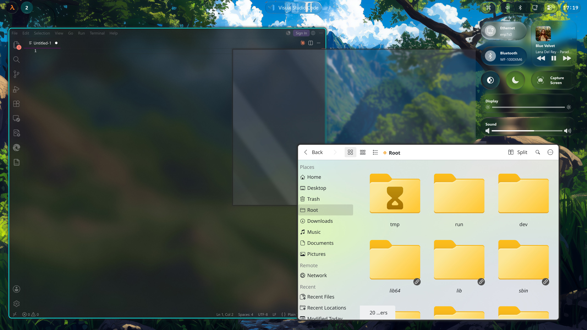
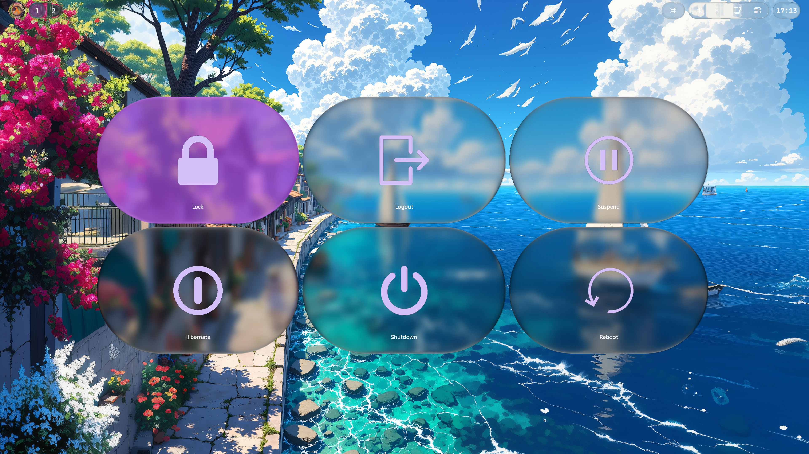

# hyprliquid

<p align="center">English | <a href="README-zh_CN.md">简体中文</a></p>

hyprliquid is a Hyprland plugin that adds Liquid Glass, Acrylic, Mica, and Aero-inspired material effects to windows and layer surfaces.

## Features

- Liquid Glass refraction with optional RGB dispersion, configurable highlights, and rounded-corner support.
- Acrylic, Acrylic Thin, Mica, Mica Alt, and Aero material effects.
- Per-window and per-layer rules, with global defaults for material-tuning options.
- Optional XDG Desktop Portal color-scheme tracking for Acrylic and Mica.
- An optional `background-share` Wayland protocol for compatible clients that need background pixels.

## Gallery

<p align="center">
    <a href="assets/Preview-1.jpeg"></a>
    <a href="assets/Preview-2.jpeg"></a>
    <a href="assets/Preview-3.jpeg"></a>
</p>

## Installation

### hyprpm

Install `cmake`, `stb`, Wayland and systemd development files, and the Hyprland development files provided by your distribution. `hyprwayland-scanner` is optional: when it is unavailable, the build uses the pre-generated protocol sources included in the repository.

```sh
hyprpm update
hyprpm add https://github.com/zaregototsukai/hyprliquid
hyprpm enable hyprliquid
```

### Nix flake

The flake provides the plugin package and a Home Manager module. Import the
module and enable it under the Hyprland window manager settings:

```nix
{
  inputs.hyprliquid.url = "github:Neuron-Group/hyprliquid";

  outputs = { hyprliquid, ... }:
    {
      homeManagerModules.default = hyprliquid.homeManagerModules.default;
      homeConfigurations.example = home-manager.lib.homeManagerConfiguration {
        modules = [
          hyprliquid.homeManagerModules.default
          {
            wayland.windowManager.hyprland.hyprliquid = {
              enable = true;
              settings = {
                effect = "liquid_glass";
                glass_dispersion = true;
                highlight_style = 2;
              };
            };
          }
        ];
      };
    };
}
```

The Home Manager module reproduces the demo desktop profile by default: it
enables Waybar, the terminal/launcher/dock session, the same five persistent
workspaces, and the same window-management hotkeys.
Workspaces created beyond those five are discovered dynamically by Waybar. Set
`hotkeys.enable = false`
if those bindings conflict with an existing Hyprland keymap.
`waybar.installConfig = true` writes the dynamic workspace files to
`~/.config/waybar/hyprliquid.jsonc` and `~/.config/waybar/hyprliquid.css`; point
your Waybar launch command at those files.

All plugin settings are available under
`wayland.windowManager.hyprland.hyprliquid.settings`. Window and layer rules
remain in `wayland.windowManager.hyprland.settings.windowrule` and
`wayland.windowManager.hyprland.settings.layerrule`, using the
`hyprliquid:<option>` rule names described below.

Set `session.enable = false` if your existing Hyprland profile already manages
the launcher, dock, terminal, or Waybar. The default session adds Fuzzel,
`nwg-dock-hyprland`, Foot, and Kitty, starts the Liquid Glass dock and Waybar
automatically, and binds `Super+Space` to the launcher plus
`Super+Shift+Space` to dock visibility.
The preset also enables Fcitx5 with the Rime engine by default; toggle
`session.inputMethod.enable = false` if another input method is already active.
Use `Ctrl+Space` to switch between the US keyboard and Rime.

For an existing Home Manager setup that keeps Hyprland in Lua mode, enable the
Lua integration and point it at any local Waybar layout:

```nix
wayland.windowManager.hyprland.hyprliquid = {
  enable = true;
  lua.enable = true;
  lua.waybarConfig = "${config.xdg.configHome}/waybar/config-hypr.jsonc";
  lua.waybarStyle = "${config.xdg.configHome}/waybar/style.css";
};
```

This generates the demo Lua configuration while leaving the consuming profile
in charge of its custom Waybar modules and styling.

### Try the bundled environment

The repository includes a complete demo configuration in `demo/hyprland.conf`.
From an existing Wayland or X11 desktop session, run it as a nested Hyprland
instance with:

```sh
nix run .#try
```

The demo loads the flake-built plugin, starts Foot, Waybar, a bottom application
dock, and Fuzzel, and includes
Liquid Glass, Acrylic, and Mica window rules. Use `Super+M` to exit the demo.
It requires an existing graphical session and does not replace the current
window manager. XWayland is disabled because the demo applications are native
Wayland clients and nested XWayland can load graphics drivers from the host
system that are incompatible with the flake's runtime. The nested output uses
a compact `960x540` mode at scale `1` with `assets/background.jpg`; use
`Super+Return` to open Foot, `Super+Shift+V` to toggle the active window
floating, or `Ctrl+Alt+V` as a fallback if the outer desktop captures Super
shortcuts. Use `Super+Q` to close a window and `Super+M` to exit. Floating a
Foot window over the wallpaper makes the Liquid Glass refraction easiest to
inspect. The demo uses `0.58` window opacity with a small one-pass blur so the
`Super+1` through `Super+5` switch between five workspaces, while
`Super+Shift+1` through `Super+Shift+5` move the active window to one. Use
`Super+H/J/K/L` to change focus, `Super+Shift+H/J/K/L` to move tiled windows,
`Super+Alt+H/J/K/L` to move floating windows, and `Super+Ctrl+H/J/K/L` to
resize them. `Super+F` toggles fullscreen,
`Super+P` toggles pseudo-tiling, and `Super+E` toggles the split direction.
The demo uses Waybar's dynamic `hyprland/workspaces` module: workspaces above
the initial persistent set appear automatically, and the active workspace
receives Waybar's `active`
style. The background remains visible through the material. Foot, Kitty, and Waybar use the
Liquid Glass `#0A58CD` tint with restrained blue application surfaces, avoiding
the fully opaque double-composited look. Use `Super+Shift+Return` to open Kitty
with the bundled color configuration.
Use `Super+Space` to open the application launcher, or `Super+Shift+Space` to toggle the
bottom dock. The dock and launcher use the same `#0A58CD` blue surface and
teal highlight as the rest of the demo.
If the dock fails to appear, inspect
`$XDG_RUNTIME_DIR/hyprliquid-demo-dock-controller.log` (or
`$XDG_RUNTIME_DIR/hyprliquid-dock-controller.log` under Home Manager) and the
corresponding per-instance log for startup diagnostics.

To validate the generated Lua configuration and confirm the plugin artifact is
present without starting a graphical Hyprland session, run:

```sh
nix run .#check
```

### Arch Linux (AUR)

```sh
# Use your preferred AUR helper, for example:
yay -S hyprliquid
```

Load the installed module:

```sh
hyprctl plugin load /usr/lib/libhyprliquid.so
```

### Manual build

Install `cmake`, `stb`, Wayland and systemd development files, and the Hyprland development files provided by your distribution. `hyprwayland-scanner` is optional: when it is unavailable, the build uses the pre-generated protocol sources included in the repository.

Clone the repository, build a release module, and install it:

```sh
git clone https://github.com/zaregototsukai/hyprliquid
cd hyprliquid
make release
sudo make install
```

Load it with:

```sh
hyprctl plugin load /usr/lib/libhyprliquid.so
```

### Load at startup

Use one of the following methods to load the plugin when Hyprland starts.

#### Lua

```lua
-- hyprpm
hl.on("hyprland.start", function ()
    hl.exec_cmd("hyprpm reload");
end);

-- AUR or manual installation
hl.plugin.load("/usr/lib/libhyprliquid.so");
```

#### Hyprlang

```ini
# hyprpm
exec-once = hyprpm reload

# AUR or manual installation
plugin = /usr/lib/libhyprliquid.so
```

## Configuration

Configuration is divided into global defaults and rule-specific overrides. For settings with a global fallback, a rule value overrides the matching global value. If neither is set, the compiled default is used.

In legacy Hyprlang configuration, global settings are declared in `plugin { hyprliquid { ... } }`. Rule-specific settings go in a `hyprliquid` block inside a `windowrule` or `layerrule`. Lua uses the nested `plugin.hyprliquid` table and `hyprliquid:<option>` rule keys.

### Lua example

```lua
if hl.plugin.hyprliquid then
    hl.config(
    {
        plugin = {
            hyprliquid = {
                watch_system_color_scheme = true,
                background_sharing = true
            }
        }
    });

    hl.window_rule(
    {
        name = "kitty",
        match = { class = "kitty" },
        border_size = 0,
        no_blur = true,
        no_shadow = true,
        ["hyprliquid:rounding_lua"] = 64,
        ["hyprliquid:effect"] = "liquid_glass",
        ["hyprliquid:tint_color"] = "rgba(0x1a, 0x1b, 0x26, 0.5)",
        ["hyprliquid:highlight_style"] = 2,
        ["hyprliquid:glass_dispersion"] = true
    });

    hl.window_rule(
    {
        name = "zen-browser",
        match = { class = "zen" },
        ["hyprliquid:effect"] = "acrylic_thin",
        ["hyprliquid:color_scheme"] = "follow_system"
    });

    hl.window_rule(
    {
        name = "vscode",
        match = { class = "code" },
        ["hyprliquid:effect"] = "acrylic",
        ["hyprliquid:color_scheme"] = "dark"
    });

    hl.window_rule(
    {
        name = "dolphin",
        match = { class = "org.kde.dolphin" },
        ["hyprliquid:effect"] = "mica_alt",
        ["hyprliquid:color_scheme"] = "light"
    });

    hl.layer_rule(
    {
        name = "waybar",
        match = { namespace = "waybar" },
        ["hyprliquid:effect"] = "liquid_glass",
        ["hyprliquid:corner_radius"] = 20,
        ["hyprliquid:highlight_style"] = 4,
        ["hyprliquid:vdf_map_mode"] = 1,
        ["hyprliquid:vdf_map_update_policy"] = "onchange"
    });

    hl.layer_rule(
    {
        name = "wlogout",
        match = { namespace = "logout_dialog" },
        blur = true,
        ["hyprliquid:effect"] = "liquid_glass",
        ["hyprliquid:corner_radius"] = 96,
        ["hyprliquid:highlight_style"] = 4,
        ["hyprliquid:vdf_map_mode"] = 2,
        ["hyprliquid:vdf_map_update_policy"] = "once"
    });
end
```

### Legacy Hyprlang example

```ini
plugin {
    hyprliquid {
        watch_system_color_scheme = on
        background_sharing = on
    }
}

windowrule {
    name = kitty
    match:class = kitty
    border_size = 0
    no_blur = on
    no_shadow = on
    rounding = 64
    hyprliquid {
        effect = liquid_glass
        tint_color = rgba(0x1a, 0x1b, 0x26, 0.5)
        highlight_style = 2
        glass_dispersion = on
    }
}

windowrule {
    name = zen-browser
    match:class = zen
    hyprliquid {
        effect = acrylic_thin
        color_scheme = follow_system
    }
}

windowrule {
    name = vscode
    match:class = code
    hyprliquid {
        effect = acrylic
        color_scheme = dark
    }
}

windowrule {
    name = dolphin
    match:class = org.kde.dolphin
    hyprliquid {
        effect = mica_alt
        color_scheme = light
    }
}

layerrule {
    name = waybar
    match:namespace = waybar
    hyprliquid {
        effect = liquid_glass
        corner_radius = 20
        highlight_style = 4
        vdf_map_mode = 1
        vdf_map_update_policy = onchange
    }
}

layerrule {
    name = wlogout
    match:namespace = logout_dialog
    blur = on
    hyprliquid {
        effect = liquid_glass
        corner_radius = 96
        highlight_style = 4
        vdf_map_mode = 2
        vdf_map_update_policy = once
    }
}
```

### Global variables

| Name | Type | Default | Description |
| --- | --- | --- | --- |
| `enabled` | `bool` | `true` | Master switch for all hyprliquid rendering. |
| `background_sharing` | `bool` | `false` | Enables the optional `background-share` Wayland protocol. It requires `EGL_MESA_image_dma_buf_export` support and a client that implements the protocol. |
| `watch_system_color_scheme` | `bool` | `false` | Watches the XDG Desktop Portal color scheme. Required for `color_scheme = follow_system`. |
| `aero_reflection_map_path` | `string` | empty | Path to a custom image used as the Aero reflection map. An empty or unreadable path uses the built-in map. (The original Win7 reflection texture hides in `C:\Windows\Resources\Themes\Aero\aero.msstyles` if you're wondering where to find it.) |

> [!NOTE]
> Set `watch_system_color_scheme` and `background_sharing` before the plugin is loaded. Restart Hyprland after changing either setting.

### Rule variables

Settings with a **Global fallback** scope may also be set globally. For `effect`, `color_scheme`, and `vdf_map_update_policy`, named values are parsed in rules; use numeric values when setting them globally. **Rule only** settings must appear in a matching `windowrule` or `layerrule`.

| Name | Scope | Type | Default | Accepted values | Description |
| --- | --- | --- | --- | --- | --- |
| `effect` | Global fallback | `string` or `int` | `acrylic` for unmatched windows; `none` for unmatched layers | `none`, `liquid_glass`, `acrylic`, `acrylic_thin`, `mica`, `mica_alt`, `aero`, or `0` through `6` | Selects the material effect. Unmatched windows use the global value; set `effect = 0` globally or `effect = none` in a rule to opt out. |
| `corner_radius` | Global fallback | `int` | `-1` | `-1` or a non-negative logical pixel value | `-1` uses the surface's Hyprland rounding value. |
| `z_radius` | Global fallback | `int` | `-1` | `-1` or a non-negative logical pixel value | Liquid Glass depth radius. `-1` uses `corner_radius`; values above the corner radius are clamped. |
| `glass_thickness` | Global fallback | `float` | `500.0` | Non-negative values recommended | Controls the Liquid Glass refraction offset. |
| `glass_ior` | Global fallback | `float` | `1.035` | Positive values recommended | Index of refraction used when RGB dispersion is disabled. |
| `glass_ior_r` | Global fallback | `float` | `1.02` | Positive values recommended | Red-channel index of refraction when RGB dispersion is enabled. |
| `glass_ior_g` | Global fallback | `float` | `1.035` | Positive values recommended | Green-channel index of refraction when RGB dispersion is enabled. |
| `glass_ior_b` | Global fallback | `float` | `1.05` | Positive values recommended | Blue-channel index of refraction when RGB dispersion is enabled. |
| `glass_dispersion` | Global fallback | `bool` | `false` | Boolean | Enables RGB dispersion and uses `glass_ior_r`, `glass_ior_g`, and `glass_ior_b`. |
| `vdf_map_mode` | Rule only | `int` | `0` | `0`, `1`, `2` | Selects the vector distance field (VDF) mode used by Liquid Glass. `0` disables VDF map generation. |
| `vdf_map_update_policy` | Global fallback | `int` globally; `string` or `int` in rules | `-2` (`always`) | Rules: `always`, `onchange`, `once`, or an interval like `250ms`, `2s`, `1min`, `1hour`; globals: numeric codes. See [VDF update policies](#vdf-update-policies). | Controls when the VDF map is rebuilt. `onchange` is an asynchronous approximation intended to reduce work. |
| `vdf_map_debug_mode` | Rule only | `int` | `0` | `0`, `1`, `2` | Enables VDF diagnostic rendering modes. |
| `tint_color` | Global fallback | color | transparent | Hyprland color syntax, for example `rgba(0x1a, 0x1b, 0x26, 0.5)` | Tints the material. A transparent value selects the material's built-in tint. |
| `brightness` | Global fallback | `float` | `1.0` | Positive values recommended | Multiplies the final material brightness. |
| `highlight_style` | Global fallback | `int` | `0` | `0` through `4` | Selects the Liquid Glass highlight treatment: <br> `0`: disabled. <br> `1`: all edges. <br> `2`: top-left and bottom-right edges. <br> `3`: OS 26-style highlight. <br> `4`: OS 27-style highlight. |
| `color_scheme` | Global fallback | `int` globally; `string` in rules | `0` (`light`) | `dark`, `light`, `follow_system` or `0` through `3` | Chooses the Acrylic and Mica palette. `follow_system` requires `watch_system_color_scheme = true`. |
| `rounding_lua` | Lua configuration and window rules only | `int` | `-1` | `-1` or a non-negative logical pixel value | Overrides a window's rounding when configuring via Lua. Hyprland's Lua API caps the regular `rounding` rule at `20`; use `rounding_lua` for larger values. Has no effect in legacy Hyprlang configuration or on layer surfaces — use the normal `rounding` setting there instead. |

### What is a VDF map?

Liquid Glass needs an edge normal to calculate refraction. For simple surfaces with one rounded rectangle, such as `kitty` or `neovide`, that normal can be calculated directly, so no VDF map is needed. Leave `vdf_map_mode` at `0` in this case.

A vector distance field (VDF) map stores, for each pixel, the vector pointing toward the relevant rounded-rectangle center. Unlike a signed distance field (SDF), it stores a vector instead of a scalar distance. hyprliquid generates VDF maps with Jump Flooding when direct calculation is insufficient.

- Use `vdf_map_mode = 1` for layouts such as `waybar` that contain multiple separated rounded rectangles.
- Use `vdf_map_mode = 2` for denser layouts such as `wlogout`, where rounded rectangles meet horizontally and vertically with gaps smaller than the corner radius. It runs Jump Flooding twice and has the highest GPU cost.

> [!NOTE]
> All rounded rectangles in the surface must use the same corner radius.

Keep `vdf_map_mode` at `0` for the lowest overhead, and enable a VDF mode only when the Liquid Glass edge treatment requires it.

### VDF update policies

- `always`: rebuilds every frame. Use it for continuously changing content; it has the highest GPU cost.
- `onchange`: rebuilds when the plugin's asynchronous texture summary changes. It is cheaper and suits occasionally changing content such as `waybar`, but small or short-lived changes can be detected late or not at all.
- `once`: builds after the surface has settled. Use it for static content such as `wlogout`.
- An interval: rebuilds at the specified interval. Bare positive numbers are interpreted as milliseconds.

### Debugging VDF maps

When the surface's corner radius is unknown, set `vdf_map_debug_mode` to `1` or `2` to enable VDF debugging. Mode `1` keeps the surface texture visible; mode `2` hides it. Areas with non-zero alpha render white, while the remaining area renders black.

Adjust `corner_radius` until the black area within the white region is as small as possible, but not completely absent. The VDF map should then be correct; remove `vdf_map_debug_mode` or set it back to `0`.

## Background sharing protocol

With `background_sharing = true`, hyprliquid advertises the unstable `zhypr_background_share_unstable_v1` protocol. It is intended for applications that implement custom effects and need access to wallpaper pixels, such as a Liquid Glass slider. Normal material rendering does not require this protocol.

For privacy, the protocol shares only pixels from the `BACKGROUND` layer. Window and non-background layer content is never shared. The protocol has no effect until a compatible client binds it.
